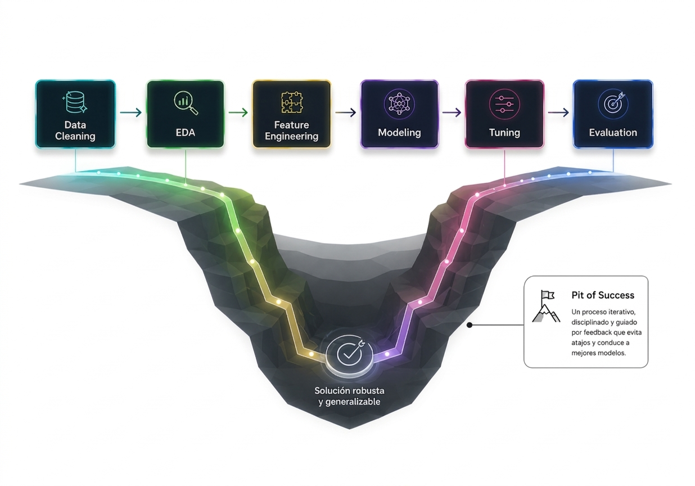
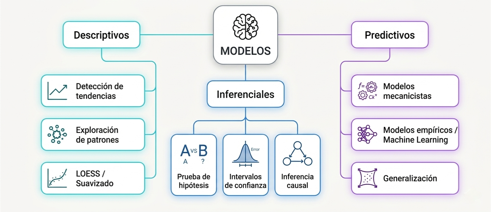
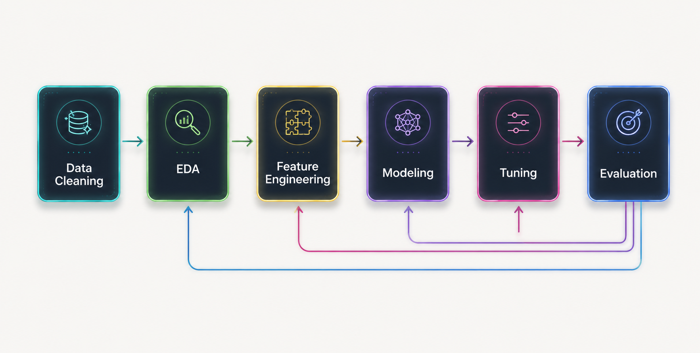
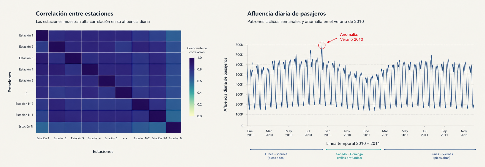
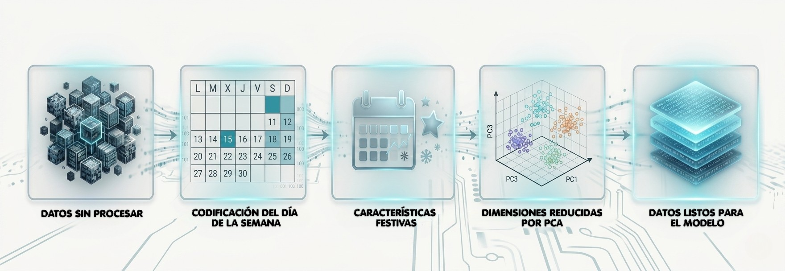
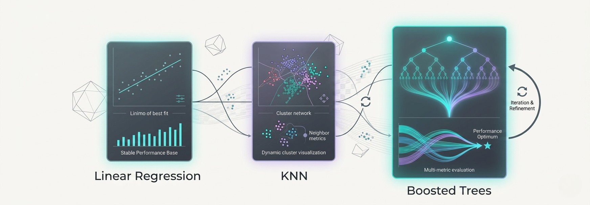
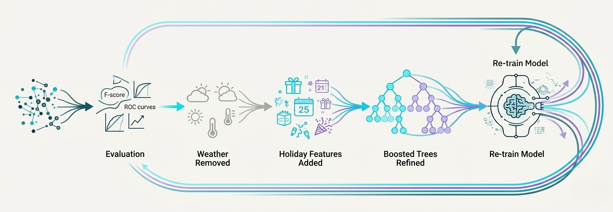
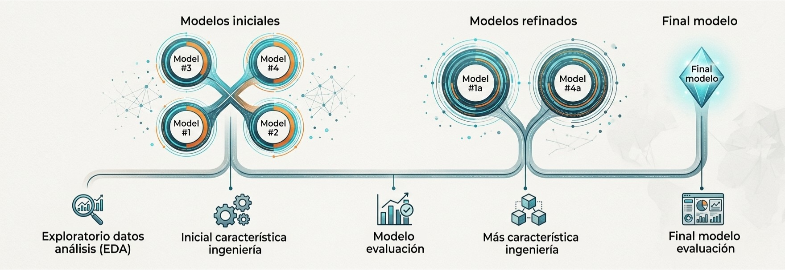

```{=html}
<style>
/* ─────────────────────────────────────────────
   GLOBAL TOKENS
───────────────────────────────────────────── */
:root {
  --bg:        #f8f7f4;
  --surface:   #ffffff;
  --ink:       #1a1a2e;
  --ink-muted: #5c5c7a;
  --accent:    #2d6a9f;
  --accent2:   #4db6ac;
  --rule:      rgba(45, 106, 159, 0.18);
  --mono:      'JetBrains Mono', monospace;
  --serif:     'DM Serif Display', Georgia, serif;
  --sans:      'DM Sans', system-ui, sans-serif;
}

/* ─────────────────────────────────────────────
   BASE TYPOGRAPHY
───────────────────────────────────────────── */
.reveal {
  font-family: var(--sans);
  font-weight: 300;
  color: var(--ink);
  background: var(--bg);
}

.reveal h1, .reveal h2, .reveal h3 {
  font-family: var(--serif);
  font-weight: 400;
  color: var(--ink);
  letter-spacing: -0.01em;
  line-height: 1.15;
  text-transform: none;
  text-shadow: none;
}

.reveal h1 { font-size: 2.6rem; }
.reveal h2 { font-size: 1.9rem; border-bottom: 1.5px solid var(--rule); padding-bottom: 0.4em; margin-bottom: 0.8em; }
.reveal h3 { font-size: 1.25rem; color: var(--accent); font-family: var(--sans); font-weight: 500; letter-spacing: 0.04em; text-transform: uppercase; font-size: 0.85rem; }
.reveal p, .reveal li { font-size: 1.05rem; line-height: 1.75; color: var(--ink); font-weight: 300; }
.reveal strong { font-weight: 500; color: var(--accent); }
.reveal code { font-family: var(--mono); font-size: 0.88em; background: rgba(45,106,159,0.08); padding: 0.1em 0.35em; border-radius: 3px; color: var(--accent); }

/* ─────────────────────────────────────────────
   SLIDE LAYOUT
───────────────────────────────────────────── */
.reveal .slides section {
  padding: 2.5rem 3.5rem;
  text-align: left;
}

/* ─────────────────────────────────────────────
   COVER SLIDE
───────────────────────────────────────────── */
.cover-wrap {
  display: flex;
  flex-direction: column;
  align-items: flex-start;
  justify-content: center;
  height: 100%;
  gap: 0;
}
.cover-eyebrow {
  font-family: var(--mono);
  font-size: 0.72rem;
  letter-spacing: 0.18em;
  color: var(--accent);
  text-transform: uppercase;
  margin-bottom: 1.2rem;
  opacity: 0.85;
}
.cover-title {
  font-family: var(--serif);
  font-size: 4rem;
  color: var(--ink);
  line-height: 1.08;
  margin: 0 0 0.5rem 0;
}
.cover-sub {
  font-family: var(--sans);
  font-size: 1.15rem;
  font-weight: 300;
  color: var(--ink-muted);
  margin-bottom: 2.8rem;
}
.cover-rule {
  width: 64px;
  height: 3px;
  background: linear-gradient(90deg, var(--accent), var(--accent2));
  border-radius: 2px;
  margin-bottom: 2.2rem;
}
.cover-meta {
  display: flex;
  gap: 2.5rem;
}
.cover-meta-item {
  display: flex;
  flex-direction: column;
  gap: 0.15rem;
}
.cover-meta-label {
  font-family: var(--mono);
  font-size: 0.62rem;
  letter-spacing: 0.15em;
  color: var(--ink-muted);
  text-transform: uppercase;
}
.cover-meta-value {
  font-size: 0.9rem;
  color: var(--ink);
  font-weight: 400;
}
.cover-deco {
  position: absolute;
  right: 2rem;
  top: 50%;
  transform: translateY(-50%);
  opacity: 0.04;
  font-family: var(--serif);
  font-size: 18rem;
  color: var(--accent);
  line-height: 1;
  user-select: none;
  pointer-events: none;
}

/* ─────────────────────────────────────────────
   CARD GRID
───────────────────────────────────────────── */
.card-grid {
  display: grid;
  grid-template-columns: repeat(2, 1fr);
  gap: 1rem;
  margin-top: 1rem;
}
.card-grid.four { grid-template-columns: repeat(4, 1fr); }
.card {
  background: var(--surface);
  border: 1px solid var(--rule);
  border-radius: 8px;
  padding: 1.2rem 1.4rem;
  position: relative;
  overflow: hidden;
}
.card::before {
  content: '';
  position: absolute;
  top: 0; left: 0; right: 0;
  height: 2.5px;
  background: linear-gradient(90deg, var(--accent), var(--accent2));
}
.card-icon {
  font-size: 1.6rem;
  margin-bottom: 0.5rem;
  display: block;
}
.card-title {
  font-family: var(--sans);
  font-weight: 500;
  font-size: 0.9rem;
  color: var(--ink);
  margin-bottom: 0.3rem;
}
.card-body {
  font-size: 0.82rem;
  color: var(--ink-muted);
  line-height: 1.5;
}

/* ─────────────────────────────────────────────
   EQUATION BLOCK
───────────────────────────────────────────── */
.eq-block {
  background: var(--surface);
  border-left: 3px solid var(--accent);
  border-radius: 0 6px 6px 0;
  padding: 1.2rem 1.8rem;
  margin: 1.2rem 0;
  box-shadow: 0 2px 12px rgba(45,106,159,0.06);
}
.eq-label {
  font-family: var(--mono);
  font-size: 0.62rem;
  color: var(--accent);
  letter-spacing: 0.14em;
  text-transform: uppercase;
  margin-bottom: 0.5rem;
}

/* ─────────────────────────────────────────────
   CONCEPT BOX / CALLOUT
───────────────────────────────────────────── */
.concept-box {
  background: rgba(45,106,159,0.05);
  border: 1px solid rgba(45,106,159,0.2);
  border-radius: 8px;
  padding: 1.1rem 1.5rem;
  margin: 0.8rem 0;
}
.concept-box.teal {
  background: rgba(77,182,172,0.06);
  border-color: rgba(77,182,172,0.25);
}
.concept-box p { margin: 0; font-size: 0.95rem; }

/* ─────────────────────────────────────────────
   PILL TAGS
───────────────────────────────────────────── */
.pill-row {
  display: flex;
  flex-wrap: wrap;
  gap: 0.5rem;
  margin-top: 0.8rem;
}
.pill {
  background: rgba(45,106,159,0.1);
  color: var(--accent);
  font-family: var(--mono);
  font-size: 0.72rem;
  padding: 0.25em 0.75em;
  border-radius: 20px;
  letter-spacing: 0.05em;
}
.pill.teal { background: rgba(77,182,172,0.12); color: #2a9d8f; }

/* ─────────────────────────────────────────────
   TAXONOMY / MERMAID WRAPPERS
───────────────────────────────────────────── */
.mermaid-wrap {
  display: flex;
  justify-content: center;
  align-items: center;
  margin-top: 0.5rem;
}

/* ─────────────────────────────────────────────
   COMPARISON TABLE
───────────────────────────────────────────── */
.compare-table {
  width: 100%;
  border-collapse: collapse;
  font-size: 0.9rem;
  margin-top: 1rem;
}
.compare-table th {
  font-family: var(--sans);
  font-weight: 500;
  font-size: 0.75rem;
  text-transform: uppercase;
  letter-spacing: 0.1em;
  color: var(--accent);
  padding: 0.6rem 1rem;
  border-bottom: 2px solid var(--rule);
  text-align: left;
}
.compare-table td {
  padding: 0.65rem 1rem;
  border-bottom: 1px solid var(--rule);
  color: var(--ink);
  font-weight: 300;
  line-height: 1.5;
}
.compare-table tr:last-child td { border-bottom: none; }
.compare-table tr:hover td { background: rgba(45,106,159,0.03); }

/* ─────────────────────────────────────────────
   ECOSYSTEM STACK
───────────────────────────────────────────── */
.eco-stack {
  display: flex;
  flex-direction: column;
  align-items: center;
  gap: 0;
  margin-top: 1rem;
}
.eco-layer {
  width: 340px;
  text-align: center;
  padding: 0.85rem 1rem;
  border-radius: 6px;
  position: relative;
}
.eco-layer.l1 { background: #1a1a2e; color: #fff; font-family: var(--mono); font-weight: 400; font-size: 1.1rem; letter-spacing: 0.08em; }
.eco-layer.l2 { background: #2d6a9f; color: #fff; font-family: var(--sans); font-weight: 400; font-size: 1rem; width: 310px; }
.eco-layer.l3 { background: #4db6ac; color: #fff; font-family: var(--sans); font-weight: 400; font-size: 1rem; width: 280px; }
.eco-arrow {
  font-size: 1.1rem;
  color: var(--ink-muted);
  padding: 0.1rem 0;
  line-height: 1;
}
.eco-caption {
  font-size: 0.72rem;
  font-family: var(--mono);
  opacity: 0.7;
  margin-top: 0.2rem;
}

/* ─────────────────────────────────────────────
   TIMELINE / ANALYST FLOW
───────────────────────────────────────────── */
.timeline {
  display: flex;
  flex-direction: column;
  gap: 0.7rem;
  margin-top: 0.8rem;
  position: relative;
  padding-left: 1.6rem;
}
.timeline::before {
  content: '';
  position: absolute;
  left: 0.45rem;
  top: 0.5rem;
  bottom: 0.5rem;
  width: 1.5px;
  background: linear-gradient(180deg, var(--accent), var(--accent2));
}
.tl-item {
  position: relative;
  padding: 0.75rem 1rem;
  background: var(--surface);
  border-radius: 6px;
  border: 1px solid var(--rule);
}
.tl-item::before {
  content: '';
  position: absolute;
  left: -1.27rem;
  top: 50%;
  transform: translateY(-50%);
  width: 9px;
  height: 9px;
  border-radius: 50%;
  background: var(--accent);
  border: 2px solid var(--bg);
}
.tl-title {
  font-weight: 500;
  font-size: 0.88rem;
  color: var(--ink);
  margin-bottom: 0.15rem;
}
.tl-body {
  font-size: 0.78rem;
  color: var(--ink-muted);
  line-height: 1.45;
}

/* ─────────────────────────────────────────────
   SLIDE NUMBER & PROGRESS
───────────────────────────────────────────── */
.reveal .progress { background: rgba(45,106,159,0.12); height: 2px; }
.reveal .progress span { background: var(--accent); }
.reveal .slide-number { font-family: var(--mono); font-size: 0.65rem; color: var(--ink-muted); background: transparent; }

/* ─────────────────────────────────────────────
   MERMAID THEME OVERRIDE
───────────────────────────────────────────── */
.reveal .mermaid svg {
  max-width: 100%;
  height: auto;
}

/* ─────────────────────────────────────────────
   INSIGHT CARDS (Slide Chicago EDA)
───────────────────────────────────────────── */
.insight-card {
  background: var(--surface);
  border: 1px solid var(--rule);
  border-radius: 8px;
  padding: 1.1rem 1.3rem;
  display: flex;
  flex-direction: column;
  gap: 0.4rem;
  border-top: 3px solid var(--accent);
}
.insight-card--teal {
  border-top-color: var(--accent2);
  background: rgba(77,182,172,0.04);
}
.insight-icon {
  font-size: 1.4rem;
  line-height: 1;
}
.insight-title {
  font-family: var(--sans);
  font-weight: 500;
  font-size: 0.88rem;
  color: var(--ink);
}
.insight-body {
  font-size: 0.8rem;
  color: var(--ink-muted);
  line-height: 1.55;
}

/* ─────────────────────────────────────────────
   PIPELINE & TECH CARDS
───────────────────────────────────────────── */
.pipeline-container {
  display: flex;
  justify-content: center;
  margin: 1.5rem 0;
}

.pipeline-img {
  max-width: 90%;
  height: auto;
  max-height: 280px;
  object-fit: contain;
  border-radius: 8px;
  box-shadow: 0 2px 12px rgba(45,106,159,0.1);
}

.tech-grid {
  display: grid;
  grid-template-columns: repeat(3, 1fr);
  gap: 1rem;
  margin-top: 1.5rem;
}

.tech-card {
  background: var(--surface);
  border: 1px solid var(--rule);
  border-radius: 6px;
  padding: 0.9rem 1.1rem;
  display: flex;
  gap: 0.75rem;
  align-items: flex-start;
  transition: all 0.2s ease;
}

.tech-card:hover {
  transform: translateY(-2px);
  box-shadow: 0 4px 16px rgba(45,106,159,0.12);
}

.tech-check {
  font-size: 1.1rem;
  line-height: 1;
  flex-shrink: 0;
}

.tech-content {
  display: flex;
  flex-direction: column;
  gap: 0.25rem;
}

.tech-title {
  font-family: var(--sans);
  font-weight: 500;
  font-size: 0.85rem;
  color: var(--accent);
  line-height: 1.3;
}

.tech-body {
  font-size: 0.75rem;
  color: var(--ink-muted);
  line-height: 1.5;
}
</style>
```

```{=html}
<!-- ══════════════════════════════════════════════
     SLIDE 1 — COVER
══════════════════════════════════════════════ -->
```

##  {.noframenumbering background-color="#f8f7f4"}

::::: columns
::: {.column width="55%"}
```{=html}
<div class="cover-deco">Σ</div>
<div class="cover-wrap">
  <div class="cover-eyebrow">Machine Learning Aplicado · Capítulo 1</div>
  <div class="cover-title">Software para<br>Modelado</div>
  <div class="cover-sub">Fundamentos del Modelado Estadístico y Machine Learning</div>
  <div class="cover-rule"></div>
  <div class="cover-meta">
    <div class="cover-meta-item">
      <span class="cover-meta-label">Contexto</span>
      <span class="cover-meta-value">Tidy Modeling with R</span>
    </div>
    
    <div class="cover-meta-item">
      <span class="cover-meta-label">Alcance</span>
      <span class="cover-meta-value">Conceptual · Práctico</span>
    </div>
  </div>
</div>
```
:::

::: {.column width="45%"}
```{=html}
<div  
  <!-- columna derecha — integrantes -->
  <div style="flex:0 0 280px; display:flex; flex-direction:column; gap:0.6rem;">
    <div style="font-family:'JetBrains Mono',monospace; font-size:0.62rem; letter-spacing:0.16em; color:#2d6a9f; text-transform:uppercase; margin-bottom:0.4rem;">Integrantes</div>

    <div style="background:rgba(45,106,159,0.03); border:1px solid rgba(45,106,159,0.12); border-radius:6px; padding:0.45rem 0.8rem;">
      <div style="font-family:'DM Sans',sans-serif; font-weight:400; font-size:0.8rem; color:#1a1a2e;">Estrella Guerra, Danilo David</div>
      <div style="font-family:'JetBrains Mono',monospace; font-size:0.65rem; color:#5c5c7a; margin-top:0.1rem;">20220763</div>
    </div>

    <div style="background:rgba(45,106,159,0.03); border:1px solid rgba(45,106,159,0.12); border-radius:6px; padding:0.45rem 0.8rem;">
      <div style="font-family:'DM Sans',sans-serif; font-weight:400; font-size:0.8rem; color:#1a1a2e;">Davalillo Figueroa, Ramón Alberto</div>
      <div style="font-family:'JetBrains Mono',monospace; font-size:0.65rem; color:#5c5c7a; margin-top:0.1rem;">20230389</div>
    </div>

    <div style="background:rgba(45,106,159,0.03); border:1px solid rgba(45,106,159,0.12); border-radius:6px; padding:0.45rem 0.8rem;">
      <div style="font-family:'DM Sans',sans-serif; font-weight:400; font-size:0.8rem; color:#1a1a2e;">Arévalo Aquije, Eduardo Daniel</div>
      <div style="font-family:'JetBrains Mono',monospace; font-size:0.65rem; color:#5c5c7a; margin-top:0.1rem;">20220756</div>
    </div>

    <div style="background:rgba(45,106,159,0.03); border:1px solid rgba(45,106,159,0.12); border-radius:6px; padding:0.45rem 0.8rem;">
      <div style="font-family:'DM Sans',sans-serif; font-weight:400; font-size:0.8rem; color:#1a1a2e;">Asencios Menacho, Luz Soledad</div>
      <div style="font-family:'JetBrains Mono',monospace; font-size:0.65rem; color:#5c5c7a; margin-top:0.1rem;">20221390</div>
    </div>
    
    <div style="background:rgba(45,106,159,0.03); border:1px solid rgba(45,106,159,0.12); border-radius:6px; padding:0.45rem 0.8rem;">
      <div style="font-family:'DM Sans',sans-serif; font-weight:400; font-size:0.8rem; color:#1a1a2e;">Gamarra Rivas, Jose Ignacio</div>
      <div style="font-family:'JetBrains Mono',monospace; font-size:0.65rem; color:#5c5c7a; margin-top:0.1rem;">20180319</div>
    </div>
  </div>
</div>
```
:::
:::::

```{=html}
<!-- ══════════════════════════════════════════════
     SLIDE 2 — ¿QUÉ ES UN MODELO?
══════════════════════════════════════════════ -->
```

## ¿Qué es un Modelo?

::::: columns
::: {.column width="55%"}
Un **modelo** es una representación matemática que captura la estructura esencial de un fenómeno complejo.

<br>

```{=html}
<div class="eq-block">
  <div class="eq-label">Forma General</div>
  $$Y = f(X_1, X_2, \ldots, X_p) + \varepsilon$$
</div>
```

```{=html}
<div class="eq-block">
  <div class="eq-label">Especificación Lineal</div>
  $$\hat{Y} = \beta_0 + \sum_{j=1}^{p} \beta_j X_j$$
</div>
```
:::

::: {.column width="45%"}
```{=html}
<div style="margin-top: 0.5rem;">
  <div class="concept-box" style="margin-bottom: 0.7rem;">
    <p>🔍 <strong>Capacidad reductiva</strong><br>
    <span style="font-size:0.85rem; color:var(--ink-muted);">Simplificar la realidad compleja en una estructura manejable</span></p>
  </div>
  <div class="concept-box">
    <p>⚖️ <strong>Sesgo–Varianza (trade-off)</strong><br>
    <span style="font-size:0.85rem; color:var(--ink-muted);">Todos los modelos son incorrectos; algunos son útiles — Box (1976)</span></p>
  </div>
  <div style="margin-top: 1rem;">
    <div class="pill-row">
      <span class="pill">Y → variable respuesta</span>
      <span class="pill">X → predictores</span>
      <span class="pill">ε → error</span>
    </div>
  </div>
</div>
```
:::
:::::

```{=html}
<!-- ══════════════════════════════════════════════
     SLIDE 3 — MODELOS EN LA VIDA DIARIA
══════════════════════════════════════════════ -->
```

## Modelos en la Vida Cotidiana

```{=html}
<p style="font-size:0.92rem; color:var(--ink-muted); margin-bottom:1.2rem;">
Los modelos predictivos condicionan las decisiones de miles de millones de usuarios cada día.
</p>

<div class="card-grid four">

  <div class="card">
    <span class="card-icon"></span>
    <div class="card-title">Netflix</div>
    <div class="card-body">Filtrado colaborativo y PLN para mostrar el próximo contenido que verás.</div>
  </div>

  <div class="card">
    <span class="card-icon"></span>
    <div class="card-title">Spotify</div>
    <div class="card-body">Características de audio y embeddings de grafos para la generación personalizada de listas.</div>
  </div>

  <div class="card">
    <span class="card-icon">️</span>
    <div class="card-title">Detección de Fraude</div>
    <div class="card-body">Puntuación de anomalías en tiempo real sobre millones de transacciones por segundo.</div>
  </div>

  <div class="card">
    <span class="card-icon">️</span>
    <div class="card-title">Pronóstico del Clima</div>
    <div class="card-body">Modelos numéricos en conjunto con capas de posprocesamiento de deep learning.</div>
  </div>

</div>

<div class="concept-box teal" style="margin-top:1.2rem;">
  <p>En todos los casos: <strong>datos estructurados + función algorítmica → predicción accionable.</strong></p>
</div>
```

```{=html}
<!-- ══════════════════════════════════════════════
     SLIDE 4 — FUNDAMENTOS DEL SOFTWARE
══════════════════════════════════════════════ -->
```

## Principios del Software de Modelado

::::: columns
::: {.column width="52%"}
Un buen software de modelado debe guiar a los analistas hacia la práctica correcta **por defecto**.

<br>

```{=html}
<div class="timeline">

  <div class="tl-item">
    <div class="tl-title">Facilidad de Uso</div>
    <div class="tl-body">Sintaxis fluida y expresiva que se corresponde con los conceptos estadísticos.</div>
  </div>

  <div class="tl-item">
    <div class="tl-title">Reproducibilidad</div>
    <div class="tl-body">Semillas, recetas versionadas y flujos de trabajo serializables.</div>
  </div>

  <div class="tl-item">
    <div class="tl-title">Protección ante Errores</div>
    <div class="tl-body">Barreras contra la fuga de datos y el orden inválido de preprocesamiento.</div>
  </div>

</div>
```
:::

::: {.column width="48%"}
```{=html}
<div style="background:var(--surface); border:1px solid var(--rule); border-radius:10px; padding:1.4rem; margin-top:0.5rem;">
  <div style="font-family:var(--mono); font-size:0.65rem; color:var(--accent); letter-spacing:0.14em; text-transform:uppercase; margin-bottom:0.8rem;">Pit of Success</div>

<div style="display:flex; justify-content:center; margin-top:1rem;">
  
</div>

  <p style="font-size:0.75rem; color:var(--ink-muted); margin:0; text-align:center; margin-top:0.3rem;">
  Los valores por defecto canalizan al analista hacia decisiones estadísticamente correctas.
  </p>
</div>
```
:::
:::::

```{=html}
<!-- ══════════════════════════════════════════════
     SLIDE 5 — ECOSISTEMA R
══════════════════════════════════════════════ -->
```

## El Ecosistema R

::::: columns
::: {.column width="48%"}
```{=html}
<div style="margin-top:0.5rem;">
  <div class="eco-stack">
    <div class="eco-layer l1">
      R
      <div class="eco-caption">Base de computación estadística</div>
    </div>
    <div class="eco-arrow">↓</div>
    <div class="eco-layer l2">
      tidyverse
      <div class="eco-caption">Gramática coherente de datos</div>
    </div>
    <div class="eco-arrow">↓</div>
    <div class="eco-layer l3">
      tidymodels
      <div class="eco-caption">Interfaz unificada de modelado</div>
    </div>
  </div>
  
  <!-- ↓ LOGOS — agregar aquí los que faltan -->
  <div style="margin-top:1.2rem; display:flex; flex-wrap:wrap; gap:1.4rem; align-items:center; justify-content:center;">
    
    
    
  </div>
</div>
```
:::

::: {.column width="52%"}
```{=html}
<div style="margin-top:0.5rem; display:flex; flex-direction:column; gap:0.75rem;">

  <div class="concept-box">
    <p>📦 <strong>Gramática consistente</strong><br>
    <span style="font-size:0.83rem;color:var(--ink-muted);">Cada paquete habla el mismo lenguaje de diseño: tibbles, pipes, tidy evaluation.</span></p>
  </div>

  <div class="concept-box">
    <p>🔁 <strong>Flujos reproducibles</strong><br>
    <span style="font-size:0.83rem;color:var(--ink-muted);">Las recetas codifican todos los pasos de preprocesamiento; los modelos son objetos serializables.</span></p>
  </div>

  <div class="concept-box teal">
    <p>🧩 <strong>Modular y extensible</strong><br>
    <span style="font-size:0.83rem;color:var(--ink-muted);"><code>parsnip</code> → especificación de modelos · <code>recipes</code> → ingeniería de variables · <code>yardstick</code> → métricas</span></p>
  </div>

</div>
```
:::
:::::

```{=html}
<!-- ══════════════════════════════════════════════
     SLIDE 6 — TAXONOMÍA (MAPA CONCEPTUAL)
══════════════════════════════════════════════ -->
```

## Taxonomía de Modelos

```{=html}
<p style="font-size:0.9rem; color:var(--ink-muted); margin-bottom:0.8rem;">
Tres objetivos principales guían todo esfuerzo de modelado.
</p>

<div style="display:flex; justify-content:center; margin-top:1rem;">
  
</div>
```

```{=html}
<!-- ══════════════════════════════════════════════
     SLIDE 7 — MODELOS DESCRIPTIVOS
══════════════════════════════════════════════ -->
```

## Modelos Descriptivos

::::: columns
::: {.column width="54%"}
**Objetivo:** entender *qué hay*, no el porqué.

<br>

```{=html}
<div class="timeline">
  <div class="tl-item">
    <div class="tl-title">Detección de Tendencias</div>
    <div class="tl-body">Resume la tendencia central y la dirección a lo largo del tiempo o entre grupos.</div>
  </div>
  <div class="tl-item">
    <div class="tl-title">Suavizado LOESS</div>
    <div class="tl-body">La regresión ponderada localmente revela patrones no lineales sin supuestos paramétricos.</div>
  </div>
  <div class="tl-item">
    <div class="tl-title">Exploración de Patrones</div>
    <div class="tl-body">Orientado al EDA: ilustra características de datos para enfatizar tendencias visuales o descubrir patrones para investigación.</div>
  </div>
</div>
```
:::

::: {.column width="46%"}
```{=html}
<!-- Conceptual scatter + LOESS SVG -->
<div style="background:var(--surface);border:1px solid var(--rule);border-radius:8px;padding:1rem;margin-top:0.5rem;">
<svg viewBox="0 0 240 180" xmlns="http://www.w3.org/2000/svg" style="width:100%;height:auto;">
  <!-- axis -->
  <line x1="24" y1="155" x2="230" y2="155" stroke="#5c5c7a" stroke-width="1"/>
  <line x1="24" y1="10"  x2="24"  y2="155" stroke="#5c5c7a" stroke-width="1"/>
  <text x="120" y="175" text-anchor="middle" font-family="DM Sans" font-size="9" fill="#5c5c7a">X</text>
  <text x="10"  y="85"  text-anchor="middle" font-family="DM Sans" font-size="9" fill="#5c5c7a" transform="rotate(-90,10,85)">Y</text>
  <!-- scatter points -->
  <circle cx="40"  cy="130" r="3" fill="rgba(45,106,159,0.35)"/>
  <circle cx="55"  cy="118" r="3" fill="rgba(45,106,159,0.35)"/>
  <circle cx="70"  cy="105" r="3" fill="rgba(45,106,159,0.35)"/>
  <circle cx="85"  cy="92"  r="3" fill="rgba(45,106,159,0.35)"/>
  <circle cx="100" cy="80"  r="3" fill="rgba(45,106,159,0.35)"/>
  <circle cx="115" cy="75"  r="3" fill="rgba(45,106,159,0.35)"/>
  <circle cx="130" cy="65"  r="3" fill="rgba(45,106,159,0.35)"/>
  <circle cx="145" cy="72"  r="3" fill="rgba(45,106,159,0.35)"/>
  <circle cx="160" cy="60"  r="3" fill="rgba(45,106,159,0.35)"/>
  <circle cx="175" cy="55"  r="3" fill="rgba(45,106,159,0.35)"/>
  <circle cx="190" cy="50"  r="3" fill="rgba(45,106,159,0.35)"/>
  <circle cx="205" cy="45"  r="3" fill="rgba(45,106,159,0.35)"/>
  <!-- LOESS curve -->
  <path d="M36,133 C60,110 80,95 110,78 C135,64 160,57 210,42"
        fill="none" stroke="#4db6ac" stroke-width="2.2" stroke-linecap="round"/>
  <text x="155" y="38" font-family="JetBrains Mono" font-size="8" fill="#4db6ac">LOESS</text>
</svg>
<p style="font-size:0.72rem;color:var(--ink-muted);text-align:center;margin:0;">Tendencia no paramétrica sin supuestos distribucionales</p>
</div>
```
:::
:::::

```{=html}
<!-- ══════════════════════════════════════════════
     SLIDE 8 — MODELOS INFERENCIALES
══════════════════════════════════════════════ -->
```

## Modelos Inferenciales

::::: columns
::: {.column width="54%"}
**Objetivo:** extraer conclusiones sobre una *población* a partir de una *muestra*.

<br>

```{=html}
<table class="compare-table">
<thead><tr><th>Concepto</th><th>Descripción</th></tr></thead>
<tbody>
<tr><td><strong>Hipótesis</strong></td><td>H₀ vs Hₐ — afirmación formal sobre un parámetro</td></tr>
<tr><td><strong>valor p</strong></td><td>P(datos | H₀) — probabilidad bajo la hipótesis nula</td></tr>
<tr><td><strong>IC</strong></td><td>Rango de valores plausibles del parámetro</td></tr>
<tr><td><strong>Supuestos</strong></td><td>Normalidad, independencia, homocedasticidad</td></tr>
</tbody>
</table>
```
:::

::: {.column width="46%"}
```{=html}
<!-- Normal distribution SVG -->
<div style="background:var(--surface);border:1px solid var(--rule);border-radius:8px;padding:1rem;margin-top:0.5rem;">
<svg viewBox="0 0 240 160" xmlns="http://www.w3.org/2000/svg" style="width:100%;height:auto;">
  <!-- shaded rejection region right -->
  <path d="M185,20 Q200,140 215,148 L215,148 L185,148 Z" fill="rgba(45,106,159,0.15)"/>
  <!-- normal curve -->
  <path d="M15,145 Q30,145 50,140 Q80,125 100,60 Q120,5 140,60 Q160,125 185,140 Q205,148 225,148"
        fill="rgba(45,106,159,0.08)" stroke="var(--accent)" stroke-width="2" stroke-linecap="round"/>
  <!-- axis -->
  <line x1="15" y1="148" x2="225" y2="148" stroke="#5c5c7a" stroke-width="1"/>
  <!-- critical value -->
  <line x1="185" y1="20" x2="185" y2="148" stroke="var(--accent)" stroke-width="1" stroke-dasharray="4,3"/>
  <text x="186" y="18" font-family="JetBrains Mono" font-size="8" fill="var(--accent)">α</text>
  <!-- CI bracket -->
  <line x1="70" y1="155" x2="180" y2="155" stroke="var(--accent2)" stroke-width="2"/>
  <line x1="70" y1="151" x2="70"  y2="158" stroke="var(--accent2)" stroke-width="2"/>
  <line x1="180" y1="151" x2="180" y2="158" stroke="var(--accent2)" stroke-width="2"/>
  <text x="115" y="168" text-anchor="middle" font-family="DM Sans" font-size="8" fill="var(--accent2)">IC 95%</text>
  <text x="120" y="148" text-anchor="middle" font-family="DM Sans" font-size="8" fill="#5c5c7a">μ</text>
</svg>
<p style="font-size:0.72rem;color:var(--ink-muted);text-align:center;margin:0;">Distribución nula con región de rechazo e intervalo de confianza</p>
</div>
```
:::
:::::

```{=html}
<!-- ══════════════════════════════════════════════
     SLIDE 9 — MODELOS PREDICTIVOS
══════════════════════════════════════════════ -->
```

## Modelos Predictivos

```{=html}
<p style="font-size:0.9rem; color:var(--ink-muted); margin-bottom:1rem;">
<strong>Objetivo:</strong> maximizar la precisión en datos <em>nuevos y no vistos</em>,  no solo explicar las observaciones existentes.
</p>

<div class="card-grid">

  <div class="card">
    <div style="font-family:var(--mono);font-size:0.65rem;color:var(--accent);letter-spacing:0.14em;text-transform:uppercase;margin-bottom:0.6rem;">Mecanístico</div>
    <div class="card-body" style="font-size:0.88rem;">
      Fundamentado en teoría de dominio.<br><br>
      • Los parámetros tienen significado físico<br>
      • Extrapola con mayor seguridad<br>
      • Requiere supuestos fuertes<br><br>
      <em style="font-size:0.8rem;color:var(--ink-muted);">Ejemplo: dosis-respuesta farmacocinética</em>
    </div>
    <div class="pill-row" style="margin-top:0.8rem;">
      <span class="pill">Basado en EDO</span>
      <span class="pill">Guiado por teoría</span>
    </div>
  </div>

  <div class="card">
    <div style="font-family:var(--mono);font-size:0.65rem;color:var(--accent2);letter-spacing:0.14em;text-transform:uppercase;margin-bottom:0.6rem;">Empírico / ML</div>
    <div class="card-body" style="font-size:0.88rem;">
      Aprendido únicamente a partir de patrones en los datos.<br><br>
      • Los parámetros son latentes / opacos<br>
      • Excelente en interpolación<br>
      • Requiere muestras grandes<br><br>
      <em style="font-size:0.8rem;color:var(--ink-muted);">Ejemplo: gradient boosted trees</em>
    </div>
    <div class="pill-row" style="margin-top:0.8rem;">
      <span class="pill teal">Basado en datos</span>
      <span class="pill teal">Alta fidelidad</span>
    </div>
  </div>

</div>

<div class="concept-box" style="margin-top:0.9rem;">
  <p>Ambos tipos comparten un objetivo común: la <strong>fidelidad </strong>, lograr la máxima precisión posible al predecir valores para datos nuevos.</p>
</div>
```

```{=html}
<!-- ══════════════════════════════════════════════
     SLIDE 10 — TERMINOLOGÍA
══════════════════════════════════════════════ -->
```

## Terminología de Modelado

::::: columns
::: {.column width="50%"}
### Paradigma de Aprendizaje

```{=html}
<table class="compare-table" style="margin-top:0.5rem;">
<thead><tr><th>Supervisado</th><th>No supervisado</th></tr></thead>
<tbody>
<tr><td>Variable Y conocida</td><td>Sin etiqueta de salida</td></tr>
<tr><td>Aprender f(X) → Y</td><td>Aprender la estructura de X</td></tr>
<tr><td>Regresión, Clasificación</td><td>Clustering, Reducción de dimensión</td></tr>
<tr><td>Evaluación con ground truth</td><td>Evaluación intrínseca</td></tr>
</tbody>
</table>
```
:::

::: {.column width="50%"}
### Tipo de Tarea

```{=html}
<table class="compare-table" style="margin-top:0.5rem;">
<thead><tr><th>Regresión</th><th>Clasificación</th></tr></thead>
<tbody>
<tr><td>Variable de salida numérica</td><td>Variable de salida categórica</td></tr>
<tr><td>RMSE, MAE, R²</td><td>Accuracy, AUC, F1</td></tr>
<tr><td>Precios de vivienda</td><td>Detección de spam</td></tr>
<tr><td>ŷ continua</td><td>Probabilidad → clase</td></tr>
</tbody>
</table>
```
:::
:::::

```{=html}
<div class="concept-box teal" style="margin-top:0.9rem;">
  <p>Elegir el paradigma correcto <em>antes</em> de tocar los datos es la primera decisión crítica del modelado.</p>
</div>
```

```{=html}
<!-- ══════════════════════════════════════════════
     SLIDE 11 — PIPELINE (FLUJOGRAMA)
══════════════════════════════════════════════ -->
```

## Pipeline de Análisis de Datos

```{=html}
<p style="font-size:0.9rem;color:var(--ink-muted);margin-bottom:0.8rem;">
Un flujo de trabajo riguroso protege contra las fuentes más comunes de error en el modelado.
</p>

<div style="display:flex; justify-content:center; margin-top:1rem;">
  
</div>
```

```{=html}
<div class="pill-row" style="margin-top:0.6rem;">
  <span class="pill">recipes</span>
  <span class="pill">parsnip</span>
  <span class="pill">tune</span>
  <span class="pill">yardstick</span>
  <span class="pill">workflows</span>
  <span class="pill">rsample</span>
</div>
```

```{=html}
<!-- ══════════════════════════════════════════════
     SLIDE 12 — MODELADO ITERATIVO
══════════════════════════════════════════════ -->
```

## Modelado Iterativo

::::: columns
::: {.column width="50%"}
El modelado nunca es lineal. Es un **ciclo** impulsado por retroalimentación en cada etapa. <br>

```{=html}
<div class="timeline">
  <div class="tl-item">
    <div class="tl-title">EDA</div>
    <div class="tl-body">Distribuciones, correlaciones, valores atípicos — ¿qué nos dicen los datos antes de preguntar?</div>
  </div>
  <div class="tl-item">
    <div class="tl-title">Ingeniería de Características</div>
    <div class="tl-body">Transformaciones, interacciones y codificaciones que incorporan conocimiento de dominio.</div>
  </div>
  <div class="tl-item">
    <div class="tl-title">Ajuste de Hiperparámetros</div>
    <div class="tl-body">Búsqueda de hiperparámetros sobre un esquema de remuestreo — nunca sobre el conjunto de prueba.</div>
  </div>
  <div class="tl-item">
    <div class="tl-title">Evaluación</div>
    <div class="tl-body">Rendimiento honesto en un conjunto reservado, una vez que todas las decisiones están finalizadas.</div>
  </div>
</div>

<div style="background:var(--surface);border:1px solid var(--rule);border-radius:10px;padding:1.6rem;margin-top:1.8rem;text-align:center;">
  <div style="font-family:var(--serif);font-size:1.4rem;color:var(--ink);line-height:1.3;margin-bottom:1rem;">
    "The process of investigating the data may not be simple."
  </div>
  <div style="font-family:var(--mono);font-size:0.7rem;color:var(--ink-muted);letter-spacing:0.1em;">
    — Wickham and Grolemund, 2016
  </div>
</div>
```
:::

::: {.column width="50%"}
```{=html}
<!-- Iterative cycle SVG — sticky para no desplazarse -->
<div style="position:sticky;top:0;">
<div style="background:var(--surface);border:1px solid var(--rule);border-radius:8px;padding:1.2rem;margin-top:0.5rem;display:flex;align-items:center;justify-content:center;">
<svg viewBox="0 0 220 220" xmlns="http://www.w3.org/2000/svg" style="width:85%;height:auto;">
  <circle cx="110" cy="110" r="80" fill="none" stroke="rgba(45,106,159,0.12)" stroke-width="28"/>
  <circle cx="110" cy="30"  r="20" fill="#2d6a9f"/>
  <text x="110" y="34" text-anchor="middle" font-family="DM Sans" font-size="9" fill="#fff" font-weight="500">EDA</text>
  <circle cx="190" cy="110" r="20" fill="#2d6a9f"/>
  <text x="190" y="108" text-anchor="middle" font-family="DM Sans" font-size="7.5" fill="#fff" font-weight="500">Ing.</text>
  <text x="190" y="118" text-anchor="middle" font-family="DM Sans" font-size="7.5" fill="#fff" font-weight="500">Caract.</text>
  <circle cx="110" cy="190" r="20" fill="#4db6ac"/>
  <text x="110" y="194" text-anchor="middle" font-family="DM Sans" font-size="9" fill="#fff" font-weight="500">Ajuste</text>
  <circle cx="30"  cy="110" r="20" fill="#4db6ac"/>
  <text x="30"  y="114" text-anchor="middle" font-family="DM Sans" font-size="9" fill="#fff" font-weight="500">Eval.</text>
  <path d="M130,32 A80,80 0 0,1 188,90" fill="none" stroke="rgba(45,106,159,0.4)" stroke-width="2" marker-end="url(#arr)"/>
  <path d="M188,130 A80,80 0 0,1 130,188" fill="none" stroke="rgba(45,106,159,0.4)" stroke-width="2" marker-end="url(#arr)"/>
  <path d="M90,188 A80,80 0 0,1 32,130" fill="none" stroke="rgba(77,182,172,0.5)" stroke-width="2" marker-end="url(#arr2)"/>
  <path d="M32,90 A80,80 0 0,1 90,32" fill="none" stroke="rgba(77,182,172,0.5)" stroke-width="2" marker-end="url(#arr2)"/>
  <defs>
    <marker id="arr"  markerWidth="6" markerHeight="6" refX="3" refY="3" orient="auto">
      <path d="M0,0 L6,3 L0,6 Z" fill="rgba(45,106,159,0.6)"/>
    </marker>
    <marker id="arr2" markerWidth="6" markerHeight="6" refX="3" refY="3" orient="auto">
      <path d="M0,0 L6,3 L0,6 Z" fill="rgba(77,182,172,0.7)"/>
    </marker>
  </defs>
</svg>
</div>
</div>
```
:::
:::::

```{=html}
<!-- ══════════════════════════════════════════════
     SLIDE 13 — CASO PRÁCTICO: CHICAGO TRANSIT
══════════════════════════════════════════════ -->
```

## Caso Práctico: Chicago Transit Authority

```{=html}
<p style="font-size:0.9rem;color:var(--ink-muted);margin-bottom:1.2rem;">
  Predicción de la afluencia diaria en el sistema de trenes de Chicago.
</p>

<div class="pipeline-container">
  
</div>

<div style="background:var(--surface); border:1px solid var(--rule); border-radius:10px; padding:1.6rem; margin-top:0.5rem; text-align:center; box-sizing:border-box;">
  <div style="font-family:var(--serif); font-size:1.4rem; color:var(--ink); line-height:1.3; margin-bottom:1rem;">
    ¿Cómo puede un modelo aprender el comportamiento diario de una ciudad?
  </div>
  
  <div class="pill-row" style="justify-content:center; flex-wrap:wrap; gap:0.5rem;">
    <span class="pill">Número de pasajeros</span>
    <span class="pill">estaciones </span>
    <span class="pill teal">clima </span>
    <span class="pill teal">patrones temporales </span>
  </div>
</div>
```

```{=html}
<!-- ══════════════════════════════════════════════
     SLIDE 13.1 — CASO PRÁCTICO: CHICAGO TRANSIT
══════════════════════════════════════════════ -->
```

## EDA: los datos comienzan a revelar estructura

```{=html}
<p style="font-size:0.9rem;color:var(--ink-muted);margin-bottom:1.2rem;">
  Exploratory Data Analysis sobre la afluencia de pasajeros
</p>

<div class="pipeline-container">
  
</div>

<div class="tech-grid">
  <div class="tech-card">
    <span class="tech-check">✅</span>
    <div class="tech-content">
      <div class="tech-title">Correlaciones estructurales</div>
      <div class="tech-body">Las estaciones presentan patrones altamente correlacionados.</div>
    </div>
  </div>
  
  <div class="tech-card">
    <span class="tech-check">✅</span>
    <div class="tech-content">
      <div class="tech-title">Diferencias semanales</div>
      <div class="tech-body">La afluencia cambia drásticamente entre días laborables y fines de semana.</div>
    </div>
  </div>
  
  <div class="tech-card">
    <span class="tech-check">✅</span>
    <div class="tech-content">
      <div class="tech-title">Anomalías</div>
      <div class="tech-body">Se detectaron fechas con ridership atípico y picos extremos.</div>
    </div>
  </div>
</div>
```


```{=html}
<!-- ══════════════════════════════════════════════
     SLIDE 13.2 — CASO PRÁCTICO: CHICAGO TRANSIT
══════════════════════════════════════════════ -->
```


## Feature Engineering: transformando los datos

```{=html}
<p style="font-size:0.9rem;color:var(--ink-muted);margin-bottom:1.2rem;">
  Las observaciones del EDA redefinen las variables del modelo
</p>

<div class="pipeline-container">
  
</div>

<div class="tech-grid">
  <div class="tech-card">
    <span class="tech-check">✅</span>
    <div class="tech-content">
      <div class="tech-title">Codificación temporal</div>
      <div class="tech-body">Las fechas fueron transformadas en variables temporales útiles.</div>
    </div>
  </div>
  
  <div class="tech-card">
    <span class="tech-check">✅</span>
    <div class="tech-content">
      <div class="tech-title">PCA</div>
      <div class="tech-body">PCA ayudó a simplificar predictores altamente correlacionados.</div>
    </div>
  </div>
  
  <div class="tech-card">
    <span class="tech-check">✅</span>
    <div class="tech-content">
      <div class="tech-title">Clima</div>
      <div class="tech-body">Las variables climáticas fueron reconsideradas durante el proceso.</div>
    </div>
  </div>
</div>
```


```{=html}
<!-- ══════════════════════════════════════════════
     SLIDE 13.3 — CASO PRÁCTICO: CHICAGO TRANSIT
══════════════════════════════════════════════ -->
```


## Modelado y ajuste iterativo

```{=html}
<p style="font-size:0.9rem;color:var(--ink-muted);margin-bottom:1.2rem;">
  Comparación, optimización y evaluación de múltiples enfoques predictivos
</p>

<div class="pipeline-container">
  
</div>

<div class="tech-grid">
  <div class="tech-card">
    <span class="tech-check">✅</span>
    <div class="tech-content">
      <div class="tech-title">Tuning</div>
      <div class="tech-body">¿Cuántos vecinos debe usar KNN?</div>
    </div>
  </div>
  
  <div class="tech-card">
    <span class="tech-check">✅</span>
    <div class="tech-content">
      <div class="tech-title">Boosting</div>
      <div class="tech-body">¿Cuántas iteraciones de boosting son necesarias?</div>
    </div>
  </div>
  
  <div class="tech-card">
    <span class="tech-check">✅</span>
    <div class="tech-content">
      <div class="tech-title">Evaluación</div>
      <div class="tech-body">¿Qué modelos minimizan el error cuadrático medio?</div>
    </div>
  </div>
</div>
```


```{=html}
<!-- ══════════════════════════════════════════════
     SLIDE 13.4 — CASO PRÁCTICO: CHICAGO TRANSIT
══════════════════════════════════════════════ -->
```


## Evaluación y retroalimentación del modelo

```{=html}
<p style="font-size:0.9rem;color:var(--ink-muted);margin-bottom:1.2rem;">
  La evaluación redefine variables, descarta enfoques y reinicia el ciclo de modelado
</p>

<div class="pipeline-container">
  
</div>

<div class="tech-grid">
  <div class="tech-card">
    <span class="tech-check">✅</span>
    <div class="tech-content">
      <div class="tech-title">Clima eliminado</div>
      <div class="tech-body">La información meteorológica no mejoró el poder predictivo.</div>
    </div>
  </div>
  
  <div class="tech-card">
    <span class="tech-check">✅</span>
    <div class="tech-content">
      <div class="tech-title">Nuevas variables</div>
      <div class="tech-body">Se incorporaron variables para representar días festivos.</div>
    </div>
  </div>
  
  <div class="tech-card">
    <span class="tech-check">✅</span>
    <div class="tech-content">
      <div class="tech-title">Selección final</div>
      <div class="tech-body">Boosted Trees mostró el mejor desempeño general.</div>
    </div>
  </div>
</div>
```


```{=html}
<!-- ══════════════════════════════════════════════
     SLIDE 13.5 — CASO PRÁCTICO: CHICAGO TRANSIT
══════════════════════════════════════════════ -->
```


## El modelo es el resultado del proceso

```{=html}
<p style="font-size:0.9rem;color:var(--ink-muted);margin-bottom:1.2rem;">
  La calidad predictiva emerge de la iteración, evaluación y refinamiento continuo
</p>

<div class="pipeline-container">
  
</div>

<div style="background:var(--surface); border:1px solid var(--rule); border-radius:10px; padding:1.6rem; margin-top:0.5rem; text-align:center; box-sizing:border-box;">
  <div style="font-family:var(--serif); font-size:1.4rem; color:var(--ink); line-height:1.3; margin-bottom:1rem;">
    La calidad del modelo depende más del proceso que del algoritmo.
  </div>
</div>
```


```{=html}
<!-- ══════════════════════════════════════════════
     SLIDE 14 — CONCLUSIONES
══════════════════════════════════════════════ -->
```

## Conclusiones

::::: columns
::: {.column width="60%"}
```{=html}
<div style="display:flex;flex-direction:column;gap:0.85rem;margin-top:0.5rem;">

  <div class="concept-box">
    <p>🔄 <strong>El modelado constituye un ciclo heurístico e iterativo</strong><br>
    <span style="font-size:0.85rem;color:var(--ink-muted);">Las fases de análisis exploratorio (EDA), ingeniería de funciones y evaluación se retroalimentan constantemente. Este proceso no es una secuencia lineal, sino un camino para ganar entendimiento profundo de los datos.</span></p>
  </div>

  <div class="concept-box">
    <p>🧰 <strong>El software promueve el foso del éxito</strong><br>
    <span style="font-size:0.85rem;color:var(--ink-muted);">Un diseño robusto guía al investigador hacia buenas prácticas científicas por defecto. Las herramientas adecuadas garantizan la reproducibilidad y protegen al usuario de cometer errores metodológicos latentes.</span></p>
  </div>

  <div class="concept-box teal">
    <p>🤝 <strong>La estadística y el machine learning son enfoques complementarios</strong><br>
    <span style="font-size:0.85rem;color:var(--ink-muted);">El rigor de las conclusiones inferenciales debe estar respaldado por la fidelidad predictiva del modelo. Un modelo con significancia estadística pero baja precisión sobre datos nuevos resulta altamente sospechoso.</span></p>
  </div>

</div>
```
:::

::: {.column width="40%"}
```{=html}
<div style="background:var(--surface);border:1px solid var(--rule);border-radius:10px;padding:1.6rem;margin-top:0.5rem;text-align:center;">
  <div style="font-family:var(--serif);font-size:1.4rem;color:var(--ink);line-height:1.3;margin-bottom:1rem;">
    "Todos los modelos están equivocados, pero algunos son útiles."
  </div>
  <div style="font-family:var(--mono);font-size:0.7rem;color:var(--ink-muted);letter-spacing:0.1em;">
    — George E. P. Box, 1976
  </div>
  <div style="margin-top:1.4rem;">
    <div class="pill-row" style="justify-content:center;">
      <span class="pill">tidymodels</span>
      <span class="pill">reproducibilidad</span>
      <span class="pill teal">iteración</span>
    </div>
  </div>
</div>
```
:::
:::::

```{=html}
<!-- ══════════════════════════════════════════════
     SLIDE 15 — CIERRE / Q&A
══════════════════════════════════════════════ -->
```

##  {.noframenumbering background-color="#1a1a2e"}

```{=html}
<div style="display:flex;flex-direction:column;align-items:flex-start;justify-content:center;height:100%;gap:0;">
  <div style="font-family:var(--mono);font-size:0.7rem;letter-spacing:0.18em;color:rgba(255,255,255,0.4);text-transform:uppercase;margin-bottom:1.2rem;">Preguntas y Discusión</div>
  <div style="font-family:var(--serif);font-size:3.4rem;color:#fff;line-height:1.1;margin-bottom:1.2rem;">Gracias.</div>
  <div style="width:60px;height:3px;background:linear-gradient(90deg,#2d6a9f,#4db6ac);border-radius:2px;margin-bottom:2rem;"></div>
  <div style="font-family:var(--sans);font-size:0.95rem;color:rgba(255,255,255,0.55);font-weight:300;line-height:1.8;">
    Referencias:<br>
    Max Kuhn &amp; Julia Silge (2022). <em>Tidy Modeling with R.</em> O'Reilly.<br>
  </div>
</div>
```

```{=html}
<!-- ══════════════════════════════════════════════
     SLIDE 16 — COVER
══════════════════════════════════════════════ -->
```

##  {.noframenumbering background-color="#f8f7f4"}

::::: columns
::: {.column width="55%"}
```{=html}
<div class="cover-deco">Σ</div>
<div class="cover-wrap">
  <div class="cover-eyebrow">Machine Learning Aplicado · Capítulo 2</div>
  <div class="cover-title">A Tidyverse<br>Primer</div>
  <div class="cover-sub">A Tidyverse Primer</div>
  <div class="cover-rule"></div>
  <div class="cover-meta">
    <div class="cover-meta-item">
      <span class="cover-meta-label">Contexto</span>
      <span class="cover-meta-value">Tidy Modeling with R</span>
    </div>
    
    <div class="cover-meta-item">
      <span class="cover-meta-label">Alcance</span>
      <span class="cover-meta-value">Conceptual · Práctico</span>
    </div>
  </div>
</div>
```
:::

::: {.column width="45%"}
```{=html}
<div  
  <!-- columna derecha — integrantes -->
  <div style="flex:0 0 280px; display:flex; flex-direction:column; gap:0.6rem;">
    <div style="font-family:'JetBrains Mono',monospace; font-size:0.62rem; letter-spacing:0.16em; color:#2d6a9f; text-transform:uppercase; margin-bottom:0.4rem;">Integrantes</div>

    <div style="background:rgba(45,106,159,0.03); border:1px solid rgba(45,106,159,0.12); border-radius:6px; padding:0.45rem 0.8rem;">
      <div style="font-family:'DM Sans',sans-serif; font-weight:400; font-size:0.8rem; color:#1a1a2e;">Estrella Guerra, Danilo David</div>
      <div style="font-family:'JetBrains Mono',monospace; font-size:0.65rem; color:#5c5c7a; margin-top:0.1rem;">20220763</div>
    </div>

    <div style="background:rgba(45,106,159,0.03); border:1px solid rgba(45,106,159,0.12); border-radius:6px; padding:0.45rem 0.8rem;">
      <div style="font-family:'DM Sans',sans-serif; font-weight:400; font-size:0.8rem; color:#1a1a2e;">Davalillo Figueroa, Ramón Alberto</div>
      <div style="font-family:'JetBrains Mono',monospace; font-size:0.65rem; color:#5c5c7a; margin-top:0.1rem;">20230389</div>
    </div>

    <div style="background:rgba(45,106,159,0.03); border:1px solid rgba(45,106,159,0.12); border-radius:6px; padding:0.45rem 0.8rem;">
      <div style="font-family:'DM Sans',sans-serif; font-weight:400; font-size:0.8rem; color:#1a1a2e;">Arévalo Aquije, Eduardo Daniel</div>
      <div style="font-family:'JetBrains Mono',monospace; font-size:0.65rem; color:#5c5c7a; margin-top:0.1rem;">20220756</div>
    </div>

    <div style="background:rgba(45,106,159,0.03); border:1px solid rgba(45,106,159,0.12); border-radius:6px; padding:0.45rem 0.8rem;">
      <div style="font-family:'DM Sans',sans-serif; font-weight:400; font-size:0.8rem; color:#1a1a2e;">Asencios Menacho, Luz Soledad</div>
      <div style="font-family:'JetBrains Mono',monospace; font-size:0.65rem; color:#5c5c7a; margin-top:0.1rem;">20221390</div>
    </div>
    
    <div style="background:rgba(45,106,159,0.03); border:1px solid rgba(45,106,159,0.12); border-radius:6px; padding:0.45rem 0.8rem;">
      <div style="font-family:'DM Sans',sans-serif; font-weight:400; font-size:0.8rem; color:#1a1a2e;">Gamarra Rivas, Jose Ignacio</div>
      <div style="font-family:'JetBrains Mono',monospace; font-size:0.65rem; color:#5c5c7a; margin-top:0.1rem;">20180319</div>
  </div>
</div>
```
:::
:::::
